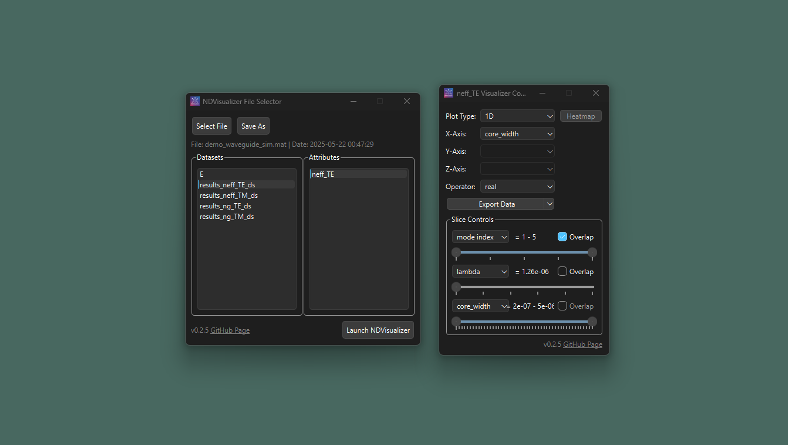
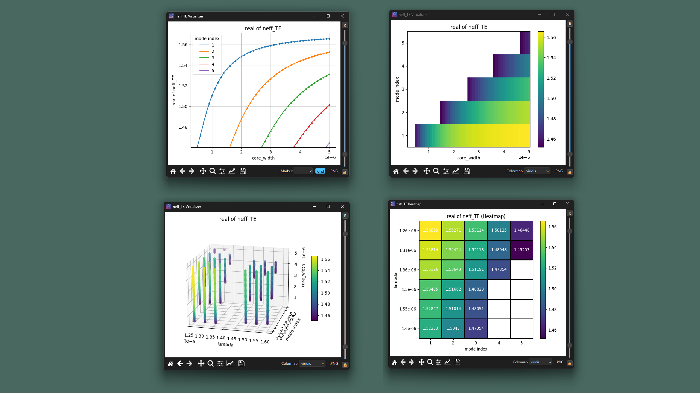

# NDVisualizer

**NDVisualizer** (**N**-**D**imensional **Visualizer**) is a high-dimensional data exploration tool that allows you to slice and visualize datasets in 1-D, 2-D, and 3-D representations, and produce professional grade figures for publications and presentations.

This tool was developed as a free, lightweight alternative for inspecting simulation datasets generated by the [Ansys Lumerical® Suite](https://optics.ansys.com/). Based on my research, no existing tool served this specific purpose—please let me know if you are aware of any. 

NDVisualizer currently supports [matrix and rectilinear datasets](https://optics.ansys.com/hc/en-us/articles/360034409554-Introduction-to-Lumerical-datasets) saved in Matlab® data files (.mat). It can also be used to visualize any datasets with the same structure. An converter is included for loading CSV file with multi-dimensional support.

Suggestions and contributions are welcome!






## Features

- Visualize and slice high-dimensional data
- Support for:
  - 1D, 2D, and 3D plots
  - Interactive data exploration
- Free and Lightweight

## Supported Formats

NDVisualizer currently supports:

- Lumerical® [Matrix and rectilinear datasets](https://optics.ansys.com/hc/en-us/articles/360034409554-Introduction-to-Lumerical-datasets) saved in MATLAB® data format `.mat`, as well as MATLAB® data file containing datasets with compatible data structure.
  <details>
  <summary>Lumerical Rectilinear Dataset structure:</summary>

  ```json
  {
    "dataset": {
      "parameters": [
        {
          "variable": ["var_name1", "var_name2", ...], 
          "name": ["disp_name1", "disp_name2", ...]
        },
        ...
      ],
      "attributes": [
        {
          "variable": ["attr_name1", "attr_name2", ...], 
          "name": ["disp_attr_name1", "disp_attr_name1", ...]
        },
        ...
      ]
    },

    "attr_name1": <attr1_data array>,
    "attr_name2": <attr2 data array>,
    ...
    "var_name1": <var1 data array>,
    "var_name2": <var1 data array>,
    ...
  }
  ```
  </details>


- Comma-Separated Values (.csv) file
- Support of more data format is comming soon.

## Installation

### Standalone Executable
An standalone executable file for Windows is available for easy use (compiled with Nuitka). Download the latest release here:


[NDVisualizer Releases](https://github.com/yuanliu-repo/NDVisualizer_py/releases)

### Using pip

Install NDVisualizer from PyPI:

```bash
pip install ndvis
```
This will install NDVisualizer and the dependencies. 

Run:
```bash
python -m ndvis
```

### Run from source code

Download the scource code or clone the repository, then install the dependencies
```bash
pip install -r requirements.txt
```
and run
```bash
python NDVisualizer_run.py
```


### Development Installation

For development or to get the latest features:

```bash
git clone https://github.com/yuanliu-repo/NDVisualizer_py.git
cd NDVisualizer_py
pip install -e .
```


## Changelogs
### v0.2.5
- add .csv file importor
- copy data to clipboard or export .csv or .mat file
- add controls for plots (colorbar and y-axis range control, save and copy plot, change line styles and colormaps, add grid to plot, etc). 
- enhance heatmap plots
- other bug fixes
- modularize the source code and upload to PyPI

### v0.2.4
- init project


## Contributions

Suggestions, issues, and pull requests are welcome! Feel free to open an issue or contribute directly.


