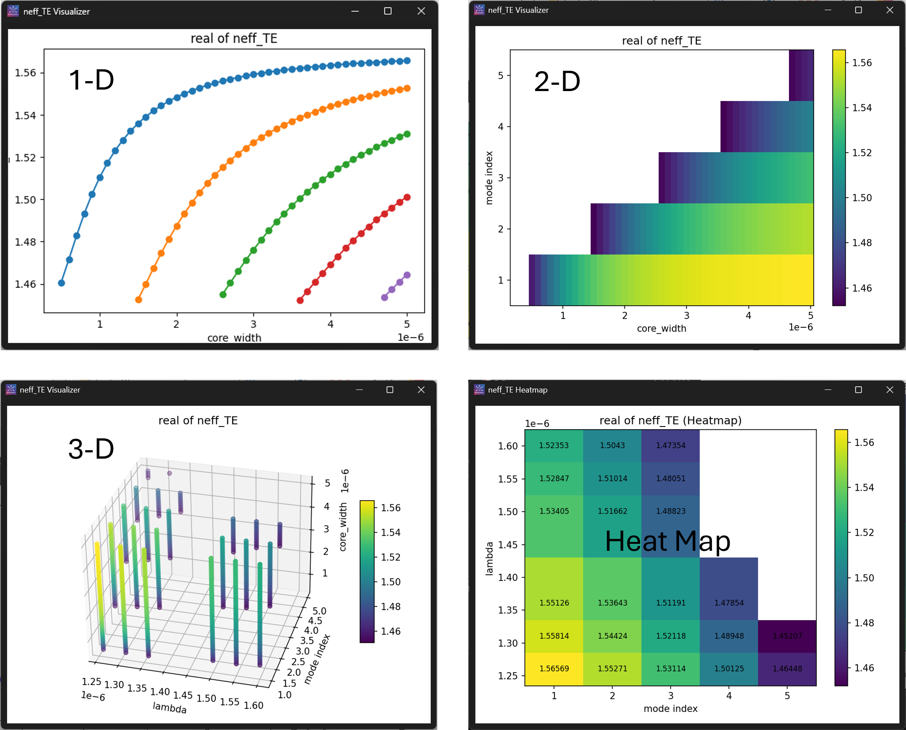

# NDVisualizer

**NDVisualizer** (**N**-**D**imensional **Visualizer**) is a high-dimensional data exploration tool that allows you to slice and visualize datasets in 1-D, 2-D, and 3-D representations.

This tool was developed as a free, lightweight alternative for inspecting simulation datasets generated by the [Ansys Lumerical® Suite](https://optics.ansys.com/). Based on my research, no existing tool served this specific purpose—please let me know if you are aware of any. 

NDVisualizer currently supports [matrix and rectilinear datasets](https://optics.ansys.com/hc/en-us/articles/360034409554-Introduction-to-Lumerical-datasets) saved in Matlab® data files (.mat). It can also be used to visualize any datasets with the same structure. Suggestions and contributions are welcome!





## Features

- Visualize and slice high-dimensional data
- Support for:
  - 1D, 2D, and 3D plots
  - Interactive exploration
- Free and Lightweight

## Supported Formats

NDVisualizer currently supports:

- Lumerical® [Matrix and rectilinear datasets](https://optics.ansys.com/hc/en-us/articles/360034409554-Introduction-to-Lumerical-datasets) saved in MATLAB® data format `.mat`, as well as MATLAB® data file containing datasets with compatible data structure.
  - Lumerical Rectlinear Dataset structure:
```json
        {
          "dataset": {
            "parameters": [
              {
                "variable": ["var_name1", "var_name2", ...], 
                "name": ["disp_name1", "disp_name2", ...]
              },
              ...
            ],
            "attributes": [
              {
                "variable": ["attr_name1", "attr_name2", ...], 
                "name": ["disp_attr_name1", "disp_attr_name1", ...]
              },
              ...
            ]
          },

          "attr_name1": <attr1_data array>,
          "attr_name2": <attr2 data array>,
          ...
          "var_name1": <var1 data array>,
          "var_name2": <var1 data array>,
          ...
        }
```

- Support of more data format is comming soon.

## Standalone Executable
An standalone executable file for Windows is available for easy use (compiled with Nuitka). Download the latest release here:

[NDVisualizer Releases](https://github.com/yuanliuus/NDVisualizer_py/releases)


## Contributions

Suggestions, issues, and pull requests are welcome! Feel free to open an issue or contribute directly.


